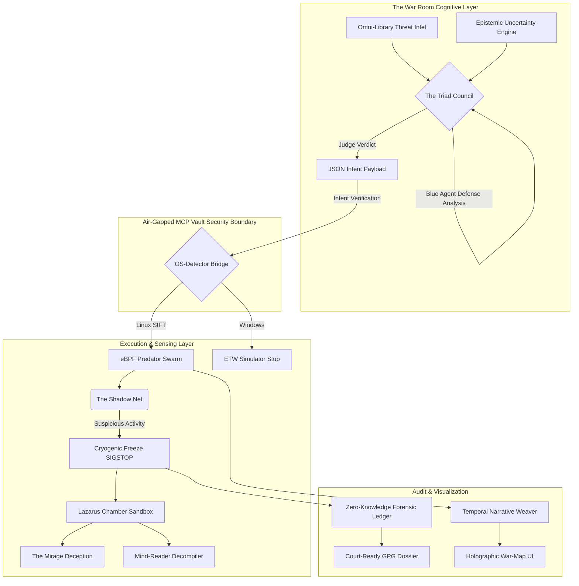
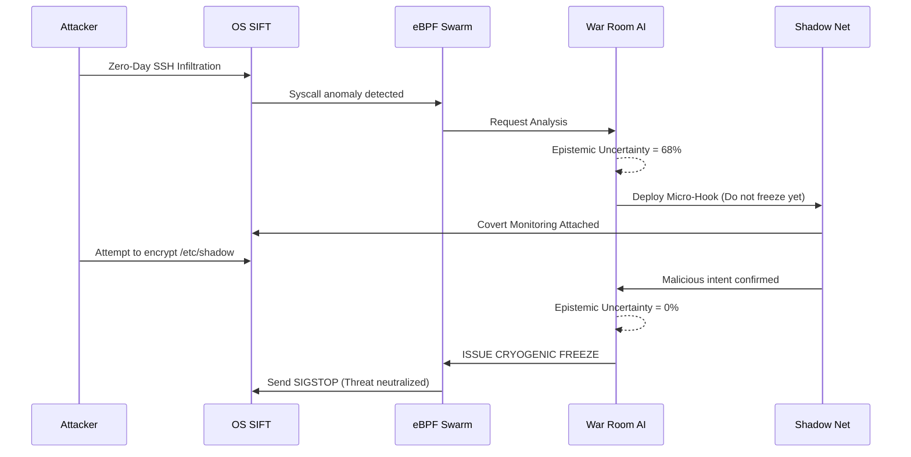
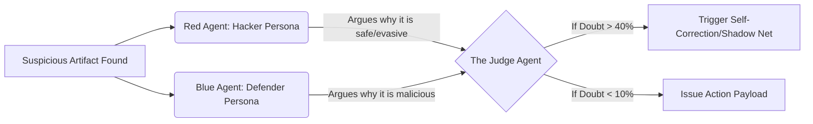

# YOMI TRIAGE SYSTEM: Autonomous DFIR Command Center

## 1. Project Overview
**Yomi Triage System** is a weapon-grade, autonomous Digital Forensics and Incident Response (DFIR) agent specifically engineered for the SANS "Find Evil!" Hackathon. Moving beyond standard AI wrappers, Yomi combines low-level kernel interception (eBPF), cryptographic ledgering, and multi-agent adversarial reasoning to detect, freeze, and interrogate threats in milliseconds without human intervention.

Yomi is designed around the **Air-Gapped MCP Vault** architecture, ensuring zero spoliation of forensic evidence by strictly enforcing type-safe execution and separating AI intent from system-level execution.

---

## 2. Core Architectural Philosophy
To meet the SANS requirements for autonomous execution, evidence integrity, and self-correction, Yomi adheres to three absolute principles:

1.  **Intent-Harness Separation:** The LLM does not execute commands. It generates JSON-formatted "Intent." A rigidly coded Python/C++ harness validates this intent before executing strictly defined, non-destructive API calls.
2.  **Cryogenic Isolation over Termination:** Yomi does not use destructive commands (e.g., `kill -9` or `rm`). Threats are cryogenically frozen in memory (`SIGSTOP` / `NtSuspendProcess`), preserving the OS state and preventing accidental system crashes (Kernel Panics).
3.  **Cryptographic Chain of Custody:** Every action, from the AI's internal reasoning to the final suspension of a PID, is recorded in a hash-chained micro-ledger and exported as a GPG-signed PDF, rendering it theoretically admissible in a court of law.

---

## 3. High-Level System Architecture Diagram

The following diagram illustrates how the 5 Evolutions of Yomi interact, separating the cognitive layer from the execution layer.

---

## 4. The 5 Final Evolutions & 28 Sub-Systems
Yomi is composed of 28 distinct tactical ideas, fused into 5 primary evolutionary modules to ensure scalability and adherence to the KISS principle.

### I. THE WAR ROOM (Autonomous Brain)
The cognitive epicenter of Yomi.

* The Omni-Library & Continuous Scraping: A local RAG database that asynchronously scrapes threat intel (CVEs, MITRE) in the background.

* The Triad Council: A multi-agent debate system (Red Team, Blue Team, Judge) evaluating artifacts to eliminate false positives.

* Epistemic Uncertainty Engine: AI measures its own doubt (0-100%). If doubt >40%, it triggers self-correction loops rather than guessing.

* JSON Intent Protocol: The AI is restricted to communicating via structured JSON, completely neutralizing prompt injection risks.

### II. THE eBPF PREDATOR SWARM (Low-Level Execution)
The stealth muscle operating at the OS level.

* Root-Cause Hunting & Evidence Swarm: Parallel micro-agents tracking temporal logs to find the "Patient Zero."

* OS-Detector Bridge: Environment-aware abstraction (eBPF for Linux/SIFT, ETW for Windows).

* Adaptive Polling: Extreme resource efficiency (<1% CPU idle, hyper-scan during attacks).

* Ghost in the Machine: Triple camouflage. Yomi masquerades as boring OS processes (systemd-journald or svchost.exe) to evade malware detection.

* Ouroboros Self-Healing Daemon: Resurrects the Yomi process in 0.1s if a threat manages to terminate it.

* Chronos Reversion & Dead-Man's Hand: Integration with LVM snapshots for auto-rollback, and a localized Kernel Panic protocol to trap evasive memory threats.

### III. THE SHADOW NET & LAZARUS PROTOCOL (Tactical Engagement)
Safe, non-destructive neutralization protocols.

* The Shadow Net: If AI doubt is high, Yomi attaches a micro-hook (spy) to the process instead of releasing it. When the malware attempts a malicious action, doubt drops to 0%, triggering the trap.

* Cryogenic Freeze: Replaces kill with memory suspension (SIGSTOP). Protects the judge's machine from crashing and allows reversibility.

* The Reverser: Automated remediation script generator.

* Lazarus Chamber & Honeypot: Isolates sleeping malware and forces execution in a secure container.

* The Mirage Protocol: Feeds real-time hallucinatory data to the trapped malware.

* Mind-Reader Decompiler: Translates ELF/EXE binaries to Assembly and profiles the attacker's psychology.

### IV. THE HOLOGRAPHIC WAR-MAP (Visualization)
* The Dark Map & SIFT Native Injection: Pure CLI executable taking over the SIFT terminal.

* Holographic Matrix TUI: Dynamic ASCII rendering of network flows.

* Interactive Kill-Chain Map: Exports D3.js visual HTML mappings of the attack.

* Temporal Narrative Weaver: Translates raw hex/logs into a senior-analyst narrative mapped to the MITRE ATT&CK Framework.

### V. ZERO-KNOWLEDGE FORENSIC LEDGER (Compliance)
* Air-Gapped MCP Vault: Custom MCP Server exposing only type-safe functions. Absolute prevention of evidence spoliation.

* The Immutable Stamp: SHA-256 hash-chained .jsonl audit trails.

* Court-Ready Cryptographic Dossier: Final report exported as a GPG-signed PDF, meeting strict legal standards.

---

## 5. Operational Workflows

### 5.1 The 60-Second Threat Response (Shadow Net Protocol)
This sequence demonstrates Yomi's response to an autonomous AI threat (e.g., Anthropic GTG-1002 scenario).

### 5.2 The Triad Council Decision Matrix
How Yomi eliminates hallucinations before taking action.

