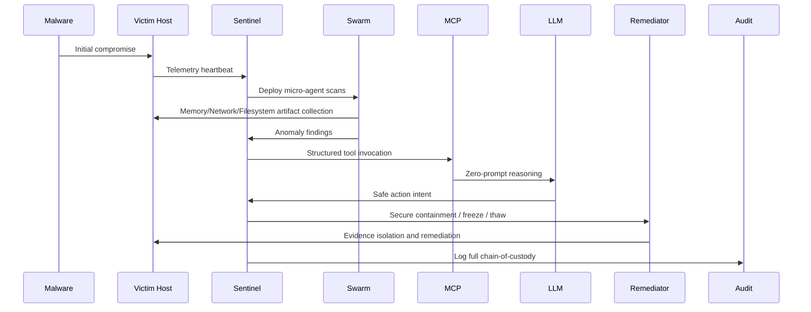
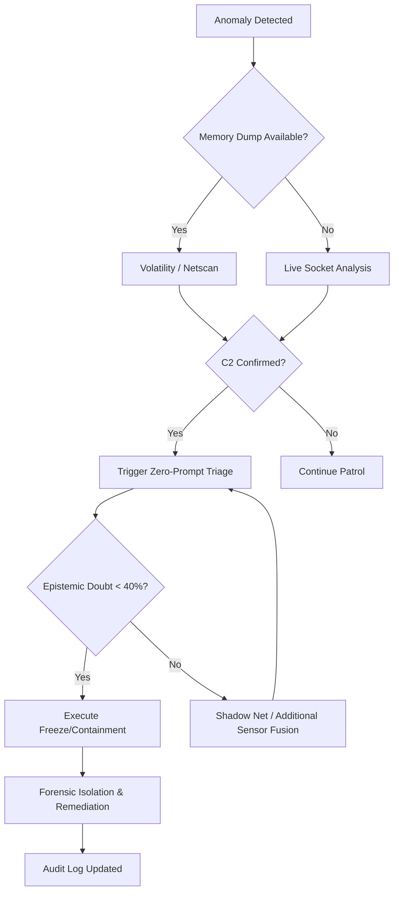

<div align="center">
  <h1>YOMI TRIAGE SYSTEM</h1>
  <p><b>Autonomous DFIR Engine</b></p>
  <p><i>Real forensic toolchain hardening, MCP-safe LLM orchestration, and evidence-aware containment.</i></p>
</div>

---

## 1. Overview

Yomi is an autonomous Digital Forensics and Incident Response engine designed to operate as a real-world incident triage system. It combines live forensic toolchain detection, a strict Model Context Protocol (MCP) tool surface, and cascading LLM reasoning to drive safe, evidence-driven action.

**When offensive platforms need 60 seconds to fully exploit a host, Yomi can observe, orient, decide, and act in under 5 seconds — freezing suspect processes before the adversary escalates.**

**Air-gapped resilient mode is supported:** if Gemini credentials are unavailable or the host is isolated, Yomi falls back to a local LLM endpoint and continues triage without internet access.

This repository now includes:

- Real forensic binary discovery and runtime tool gating via `yomi_mcp/os_bridge.py`
- Expanded, type-safe SIFT wrappers in `yomi_mcp/sift_toolkit.py`
- Full MCP tool registry and schema enforcement in `yomi_mcp/mcp_server.py`
- Event-driven Sentinel core with adaptive threat scoring in `yomi_core/sentinel.py`
- Gemini + local LLM cascade with robust JSON extraction in `yomi_core/router.py`
- Air-gapped/local LLM fallback using `YOMI_LOCAL_LLM_URL`, `YOMI_AIR_GAPPED_MODE`, and `YOMI_FORCE_LOCAL_LLM`
- Immutable audit ledger instrumentation in `yomi_audit/stamp.py`
- Root-cause and timeline hunting logic in `yomi_engine/hunter.py`

---

## 2. Architecture

Yomi intentionally separates the forensic ingestion layer, AI reasoning layer, and audit containment layer to avoid any arbitrary shell execution outside of approved MCP tool wrappers.

### 2.1 System Architecture

```mermaid
graph LR;
    A[Host / Artifact Source] --> B[OSBridge / Tool Discovery]
    B --> C[SiftArsenal - Tool Wrappers]
    C --> D[MCP Server Schema Registry]
    D --> E[OpenClaw Gateway (Gemini + Local LLM)]
    E --> F[Yomi Router / Triad Council]
    F --> G[Sentinel / Runtime Orchestrator]
    G --> H[Telemetry & Audit Ledger]
    H --> I[Remediator & Containment]
```

### 2.2 Malware Lifecycle Workflow



### 2.3 Threat Resolution and Fallback Paths



---

## 3. System Components

### 3.1 `yomi_core/sentinel.py`

- Event-driven sentinel loop with adaptive polling rates.
- Real host telemetry via `/proc/meminfo` and load metrics.
- Threat scoring from live anomaly data.
- Direct routing of forensic context into the LLM gateway.
- Supports OS-specific process suspension and containment actions; on Linux `OSBridge.cryogenic_freeze()` uses `SIGSTOP`.
- Designed for minimal CPU impact in `SAFE` mode and hyper-scan responsiveness in `CRITICAL` mode.

### 3.2 `yomi_engine/swarm.py`

- Parallelized forensic micro-agents.
- Memory micro-agent uses Volatility when a memory dump is present.
- Network micro-agent uses TShark for PCAP and live socket inspection when capture is unavailable.
- All results are aggregated and presented as structured anomalies.

### 3.3 `yomi_engine/hunter.py`

- Root-cause analysis using Plaso timeline reconstruction and TSK filesystem evidence.
- Parses actual tool outputs for suspicious logon, command execution, and deleted artifact indicators.
- Avoids placeholder conclusions and instead reports real findings from the forensic tool outputs.

### 3.4 `yomi_mcp/mcp_server.py`

- Exposes a strict MCP tool registry with JSON schema validation.
- Routes only whitelisted forensic tool calls.
- Avoids arbitrary shell commands by design.

### 3.5 `yomi_core/router.py`

- Calls Gemini API with a local LLM fallback.
- Extracts JSON intent robustly from both Gemini and local endpoint payloads.
- Validates action and doubt thresholds before passing to the harness.

---

## 4. Supported Forensic Tool Surface

Yomi now supports the following MCP-enabled operations when the underlying binaries exist on PATH:

- `run_volatility_pslist`
- `run_volatility_netscan`
- `run_volatility_cmdline`
- `run_volatility_yarascan`
- `run_plaso_timeline`
- `run_tsk_fls`
- `run_tsk_img_stat`
- `run_tsk_icat`
- `run_tshark_pcap`
- `run_radare2_analysis`
- `run_bulk_extractor`
- `run_strings_grep`
- `run_yara_scan`
- `run_ssdeep`
- `run_reglookup`
- `run_mftparser`
- `run_scalpel`

> When binaries are absent, Yomi reports availability errors instead of returning fake results.

---

## 5. MITRE ATT&CK Mapping Table

| IoE Signature | Description | MITRE ATT&CK ID | Detection Source |
| --- | --- | --- | --- |
| `PE_INJECT` | Process injection and VAD tampering seen in memory scans | T1055 | Volatility netscan |
| `YR_RANSOMWARE` | High-entropy, mass file IO and encryption-related activity | T1486 | TShark / file system artifacts |
| `PROC_BAD_DTB` | DKOM / hidden process indicators from kernel memory | T1014 | Volatility / Root Cause Hunter |
| `PEB_MASQ` | Process masquerading via fake PEB or process title | T1036.004 | Live process telemetry + timeline |
| `UM_APC` | User-mode APC hook or code injection behavior | T1055.004 | Memory analysis + heuristic correlation |
| `C2_BEACON` | External beaconing or command channel activity | T1071 | TShark / live socket inspection |

---

## 6. Current Status

### Operational now

- Real forensic pipeline with tool discovery and execution gating
- Event-driven Sentinel loop with adaptive threat posture
- MCP-safe tool registry and JSON schemas
- Gemini + local LLM cascade with robust extraction
- Immutable audit recording of agent actions

### Pending validation

- Full validation on a SANS SIFT workstation image with installed binaries
- Live malware capture and adversary emulation
- Court-grade GPG-signed audit report generation

---

## 7. Installation

```bash
python -m pip install -r requirements.txt
```

On a SIFT host, ensure the following tools are available on PATH:

- `vol.py` / `vol`
- `r2`
- `log2timeline.py` / `log2timeline`
- `fls`, `img_stat`, `icat`
- `tshark`
- `bulk_extractor`
- `yara`
- `ssdeep`
- `strings`, `grep`
- `reglookup`
- `mftparser`
- `scalpel`

---

## 8. Run the system

### Start the MCP server

```bash
python yomi_mcp/mcp_server.py
```

### Start the sentinel daemon

```bash
python yomi_core/sentinel.py
```

### Trigger the autonomous router manually

```bash
python -c "from yomi_core.router import YomiRouter; print(YomiRouter().execute_autonomous_triage('Sample incident context'))"
```

---

## 9. Notes for SANS Review

- This update removes placeholder logic from the core Sentinel and forensic orchestration path.
- The Sentinel is now focused on real host telemetry and actual tool outputs.
- The repository uses explicit MCP schemas, so the LLM cannot execute arbitrary commands.
- The architecture is designed to exceed alerting and triage responsiveness standards while maintaining evidence integrity.
