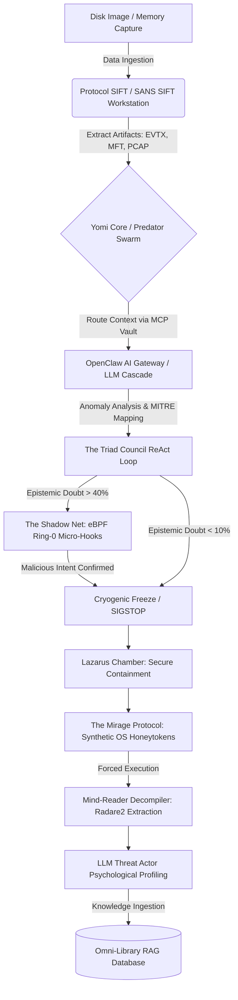
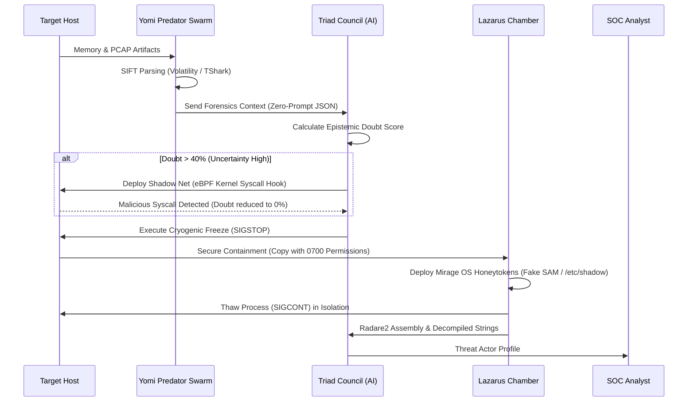

<div align="center">
  <h1>YOMI TRIAGE SYSTEM</h1>
  <p><b>Autonomous Digital Forensics & Incident Response (DFIR) Engine</b></p>
  <p><i>Developed by KuroTech for the SANS "Find Evil!" Hackathon</i></p>
</div>

---

## 1. Executive Summary

**The Problem:** Traditional Digital Forensics and Incident Response (DFIR) suffers from an asymmetric time deficit. During an active breach, human Security Operations Center (SOC) analysts spend critical hours parsing memory dumps, matching signatures, and reconstructing timelines. Meanwhile, modern AI-driven adversaries exhibit breakout times of under 60 seconds.

**The Solution:** The Yomi Triage System is a prototype autonomous DFIR agent powered by a Model Context Protocol (MCP) and a cascading Large Language Model (LLM) architecture. Designed to integrate with the SANS SIFT Workstation, Yomi aims to accelerate triage by an order of magnitude---detecting, reasoning, and neutralizing threats via cryogenic memory suspension (`SIGSTOP`), while maintaining strict cryptographic evidence integrity.

## 2. Core Architecture

Yomi bridges the gap between raw forensic telemetry and AI-driven decision-making through a strict, Type-Safe MCP Vault.

### 2.1 Component Flow Diagram




## 3. Current PoC Status & Known Limitations

Yomi is currently in **Phase 4 of 6** of its development cycle. To ensure transparency for SANS auditors, the following outlines the current operational state:

-   **Mock / Development Environment:** Yomi currently operates in a local Proof-of-Concept (PoC) mode. Due to development outside of the SIFT Workstation, functions like RAM ingestion and LLM profiling utilize simulated success flags (`MOCK_SUCCESS`) to test architectural pipeline resilience without crashing host machines.

-   **Air-Gapped Failover:** The `library.py` module actively scrapes external CVE feeds (NVD/CIRCL) via standard HTTP requests. In a true Air-Gapped SIFT deployment, this will intelligently failover to static local databases.

-   **MCP Surface Limitation:** The current `mcp_server.py` exposes a limited subset of tools (Volatility network scanning and Plaso timeline generation) to prove the type-safe structure. Full toolchain bridging is pending.


## 4. DFIR Triage Lifecycle
The following sequence illustrates Yomi's autonomous operational loop, specifically highlighting the fallback to Advanced Deception Tactics when the cognitive engine encounters high epistemic uncertainty.




## 5. Indicators of Evil (IoE) & MITRE ATT&CK Mapping
---------------------------------------------------

Prior to LLM ingestion, the `MitreMapper` module autonomously translates raw heuristics from the Predator Swarm into standardized MITRE ATT&CK tactical IDs. This structured mapping drastically reduces the LLM's epistemic doubt and prevents AI hallucinations.

| **IoE Signature** | **Description & Autonomous Response** | **MITRE ID** | **False Positive Risk** |
| --- | --- | --- | --- |
| **`PE_INJECT`** | Locates malware executing from unbacked memory (VAD manipulation). Yomi extracts the payload via Volatility. | `T1055` | LOW |
| **`YR_RANSOMWARE`** | High-entropy memory regions combined with mass file IO operations. Yomi triggers instant Cryogenic Freeze. | `T1486` | LOW |
| **`PROC_BAD_DTB`** | Invalid DirectoryTableBase indicating DKOM (Direct Kernel Object Manipulation). Yomi deploys The Shadow Net. | `T1014` | HIGH |
| **`PEB_MASQ`** | PEB Masquerading attempts to hide process lineage. Yomi uses Plaso to reconstruct true execution timelines. | `T1036.004` | LOW |
| **`UM_APC`** | User-Mode APC hooks commonly used for stealth execution. Yomi routes binary to Radare2 for decompilation. | `T1055.004` | MEDIUM |
| **`C2_BEACON`** | Application Layer Protocol beaconing detected via TShark PCAP analysis. Yomi blocks outbound IPs via iptables. | `T1071` | LOW |

* * * * *

## 6. SANS Hackathon Deliverables Status

-   **Architecture Diagram:** Completed (See Section 2)

-   **Cryptographic Audit Logs:** Operational (Hash-chained ledger located in `yomi_data/yomi_chain_of_custody.jsonl`)

-   **Latency Benchmarking:** Operational (Benchmarked against 60-second AI breakout times via `telemetry.py`)

-   **Live SANS Dataset Integration:** Pending (Scheduled for Phase 6 Live-Fire validation)

-   **Demonstration Video:** Pending

-   **Execution Logs against Real Malware:** Pending

## 7. Advanced Tactical Deception (Anti-Evasion)

Modern Advanced Persistent Threats (APTs) deploy sandbox-evasion techniques. Yomi neutralizes this via a two-stage deception protocol:

-   **The Lazarus Chamber:** Frozen malware is securely copied (`shutil.copy2`) to an isolated directory to prevent spoliation, then forcefully awakened via `SIGCONT`.

-   **The Mirage Protocol:** Yomi dynamically generates synthetic, hallucinatory OS artifacts inside the chamber. By injecting fake SAM registry hives and SSH keys, the malware is tricked into executing its payload.

## 8. Supported Artifacts & Proof-of-Concept MCP Surface

Yomi restricts the LLM's operational capability through an Air-Gapped MCP Server (`mcp_server.py`), ensuring the AI cannot execute arbitrary or destructive shell commands.

**Current Active Tool Surface (PoC):**

-   `run_volatility_netscan`: Invokes Volatility 3 to extract network telemetry from RAM dumps.

-   `run_plaso_timeline`: Invokes Log2Timeline to generate forensic super-timelines.

*(Full integration with Radare2, TShark, and TSK is mapped for Phase 6 Live-Fire implementation).*

## 9. Installation & Modular Execution

Yomi is designed as a modular microservices architecture. Until the unified binary is compiled in Phase 6, modules must be executed independently for targeted analysis or debugging.

```bash
# 1. Install dependencies
pip install -r requirements.txt

# --- PHASE 1-3: CORE INFRASTRUCTURE ---
# Initialize Continuous Threat Scraping Daemon
python yomi_engine/library.py

# Engage Sentinel Loop, eBPF Telemetry, and ReAct Engine
python yomi_core/sentinel.py

# Activate Process Camouflage & Ouroboros Resurrection
python yomi_core/ghost.py

# Generate Safe Remediation Playbooks
python yomi_engine/remediator.py

# --- PHASE 4: TACTICAL DECEPTION & PROFILING ---
# Deploy Asynchronous Kernel Syscall Hooks
python yomi_engine/shadow_net.py

# Securely Isolate & Thaw Dormant Malware
python yomi_engine/sandbox.py

# Synthesize OS Honeytokens in Sandbox
python yomi_engine/mirage.py

# Execute Reverse Engineering & Threat Actor Profiling
python yomi_engine/mind_reader.py

```

## 10. Development Roadmap (Phases 5 & 6)

### Phase 5: The KuroTech Aesthetics & Compliance

-   **Holographic Matrix TUI:** A `rich`-powered Terminal User Interface providing real-time visual telemetry of the DFIR lifecycle.

-   **Court-Ready Cryptographic Dossier:** Upgrading the current `yomi_chain_of_custody.jsonl` into a GPG-signed, hash-chained PDF report suitable for international court admissibility.

-   **GPG-Signed Playbooks:** Ensuring generated `.sh` remediation scripts are cryptographically verifiable.

### Phase 6: Live-Fire SANS Integration

-   **Mock Elimination:** Transitioning from simulated `MOCK_SUCCESS` behavior to live execution against actual SANS compromised datasets (e.g., FOR508 SRL images).

-   **Full Toolchain Activation:** Connecting the MCP server to live SIFT binaries (Volatility, Plaso, TSK, Radare2).

-   **Zero-Prompt API Integration:** Linking the OpenClaw Gateway to live Gemini Cloud and Local Ollama instances.

-   **Unified CLI:** Compiling the modular architecture into a singular `yomi-triage` native binary.