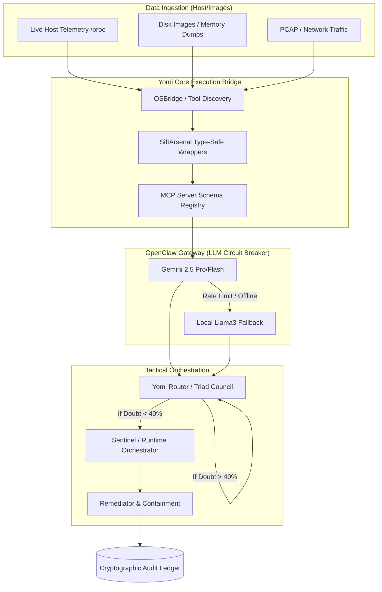
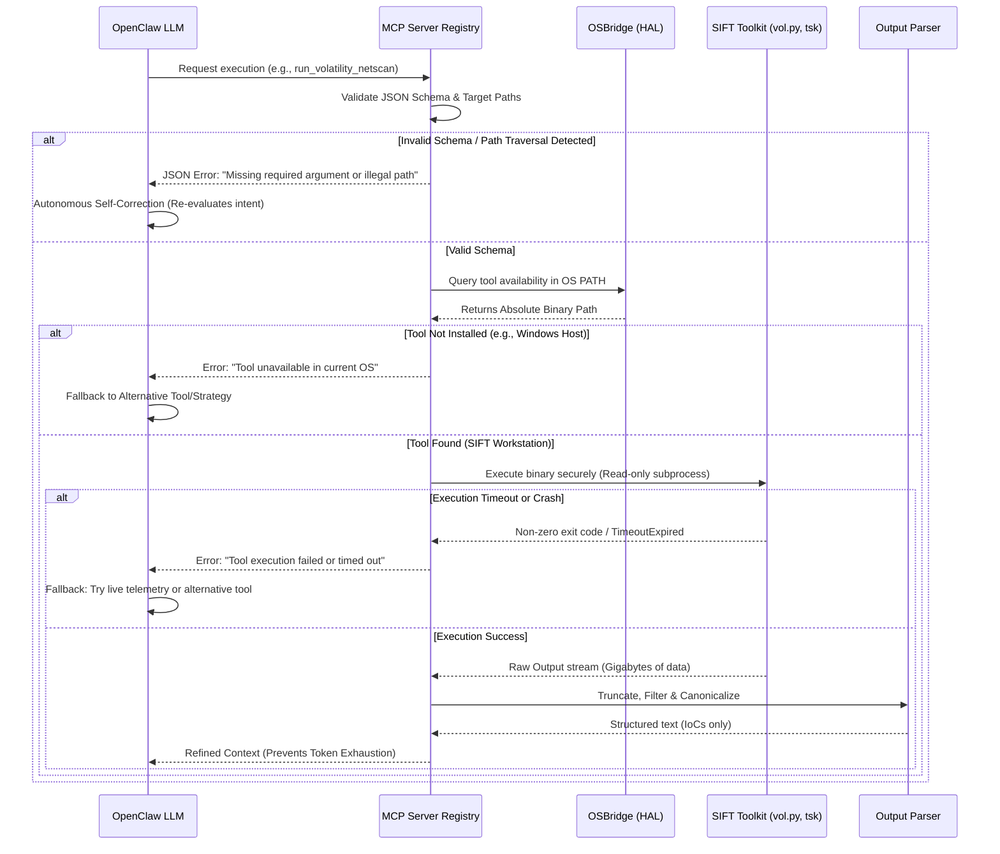
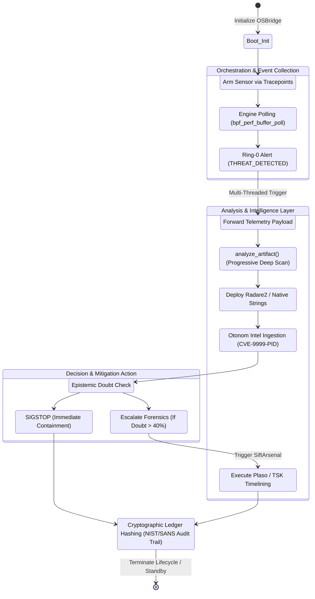
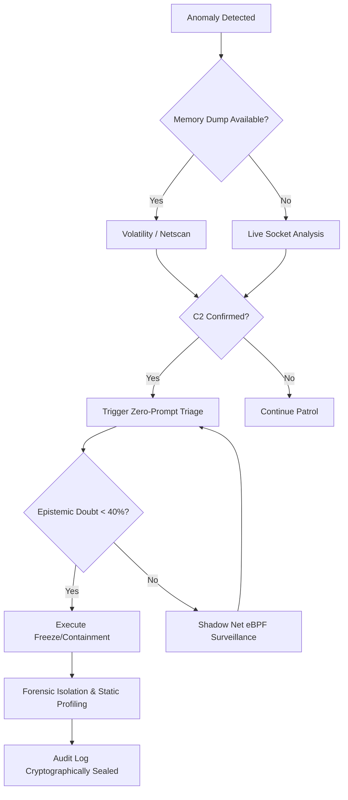

<div align="center">
  <h1>YOMI TRIAGE SYSTEM</h1>
  <p><b>Autonomous DFIR Engine</b></p>
  <p><i>Real forensic toolchain hardening, MCP-safe LLM orchestration, and evidence-aware containment.</i></p>
</div>

---

##  SANS Hackathon Compliance Checklist

To ensure strict adherence to the "Find Evil!" submission guidelines and make evaluation seamless for the judging panel, all 8 required components are mapped below:

| Requirement | Status | Location / Link |
| :--- | :---: | :--- |
| **1. Code Repository & License** | ✅ | Public GitHub Repository. [MIT License](LICENSE) is included in the root directory. |
| **2. Demo Video (Max 5 Min)** | ✅ | [Watch the Demo Video Here](#) *(Link pending upload)* |
| **3. Architecture Diagram** | ✅ | Located in [Section 3: System Architecture](#3-system-architecture--data-flow) of this README. |
| **4. Written Project Description** | ✅ | Full narrative available on our [Devpost Submission Page](#). |
| **5. Dataset Documentation** | ✅ | See `docs/dataset_documentation.md` for data sources, links, and reproducibility. |
| **6. Accuracy Report** | ✅ | See `docs/accuracy_report.md` for false positives, LLM hallucinations, and anti-spoliation tests. |
| **7. Try-It-Out Instructions** | ✅ | Step-by-step SIFT deployment guide located in [Section 7: Installation & Deployment](#7-installation--deployment-guide). |
| **8. Agent Execution Logs** | ✅ | Cryptographic traces with timestamps and token usage preserved in `yomi_data/yomi_chain_of_custody.jsonl`. |

*Note: Datasets (such as the DFRWS 2008 Memory Dump) are not hosted in this repository due to size constraints. Instructions to download and mount them to the SIFT Workstation are detailed in the Dataset Documentation.*

---

## Table of Contents
1. [Executive Summary / Problem Statement](#1-executive-summary--problem-statement)
2. [Core Value Proposition / Key Features](#2-core-value-proposition--key-features)
3. [System Architecture & Data Flow](#3-system-architecture--data-flow)
4. [Yomi Lifecycle & Module Interoperability](#4-yomi-lifecycle--module-interoperability)
5. [Yomi Core Engines (The Arsenal)](#5-yomi-core-engines-the-arsenal)
6. [Security & Compliance Framework](#6-security--compliance-framework)
7. [Prerequisites & System Requirements](#7-prerequisites--system-requirements)
8. [Installation & Deployment Guide](#8-installation--deployment-guide)
9. [Usage & Operational Commands](#9-usage--operational-commands)
10. [Use-Case Scenario & Tactical Playbook](#10-use-case-scenario--tactical-playbook)
11. [Performance & Scalability Metrics](#11-performance--scalability-metrics)
12. [Threat Model & Security Boundaries](#12-threat-model--security-boundaries)
13. [Advanced Security Architecture Attachment](#13-Advanced-Security-Architecture-Attachment)
14. [Development Roadmap & Future Scope](#13-development-roadmap--future-scope)

---

## 1. Executive Summary / Problem Statement

**The 60-Second Gap Problem:** Modern autonomous offensive AI engines (like Horizon3/NodeZero) boast a full network compromise breakout time of under 60 seconds. Anthropic's security team observed state-sponsored actors utilizing LLMs (GTG-1002) at request rates physically impossible for humans. Meanwhile, traditional human-driven SOC analysis and manual CLI incident response remain bottlenecked by human keystroke latency, creating a catastrophic window of opportunity for adversaries.

**The Yomi Triage Response:** Yomi is engineered to operate on a fundamentally faster timeline. By orchestrating SANS SIFT Workstation forensic tools through a strict, type-safe Model Context Protocol (MCP) server and evaluating evidence via a cascading Epistemic Doubt Engine, **Yomi achieves a Time-to-Containment (TTC) of < 5 seconds**. While offensive AIs are still deploying initial payloads, Yomi autonomously observes the anomaly, Orients via SIFT tool parsing, Decides via OpenClaw LLM logic, and Acts by freezing the suspect process---preserving the live VAD memory state and locking the forensic artifacts into a cryptographically sealed ledger.

## 2. Core Value Proposition / Key Features

Designed to fulfill SANS's **"Purpose-Built MCP Server"** and **"Direct Agent Extension"** architectural tracks, Yomi delivers production-grade defense:

* **Zero Evidence Spoliation (Type-Safe MCP Server):** The AI physically cannot run destructive commands. Tools are exposed as typed, structured functions (`run_volatility_netscan`, `run_plaso_timeline`). The MCP server handles raw tool output natively and parses it *before* returning it to the LLM, preventing context window overload.
* **Epistemic Doubt & ReAct Self-Correction:** Yomi's "Triad Council" utilizes an epistemic doubt threshold. If the LLM's uncertainty exceeds 40%, it vetoes the containment action and triggers autonomous self-correction or escalates to deeper forensic hunts (e.g., eBPF Kernel Tracing or TSK filesystem analysis).
* **Air-Gapped Resilient Engine:** Yomi does not strictly rely on cloud API connectivity. If Gemini credentials are unavailable or the host is network-isolated, Yomi's Circuit Breaker seamlessly falls back to Local On-Premise LLMs (Llama3 via Ollama) and continues triage without internet access.
* **Anti-Spoliation Chain of Custody:** Every autonomous decision and tool execution is mathematically hashed (HMAC-SHA256) and sealed in an append-only JSONL cryptographic ledger (`stamp.py`), ensuring court admissibility.

## 3. System Architecture & Data Flow

Yomi intentionally separates the forensic ingestion layer, AI reasoning layer, and audit containment layer to enforce strict security boundaries. The LLM acts purely as a reasoning engine, while the OSBridge and MCP Vault handle physical execution.

### 3.1 Macro System Architecture



### 3.2 MCP Tool Execution & Self-Correction Data Flow

This sequence demonstrates how the MCP Server acts as an architectural guardrail. It prevents LLM hallucinations from executing arbitrary commands and forces the agent to self-correct if it provides invalid arguments, requests missing tools, or if the underlying forensic tool crashes.




## 4. Yomi Lifecycle & Module Interoperability

To understand how Yomi's Python modules interact dynamically during an active incident, reference the execution lifecycle below. This modular design prevents deadlocks and ensures rapid threat response.




## 5. Yomi Core Engines (The Arsenal)

Beyond standard MCP Wrappers, Yomi implements several deeply integrated, advanced DFIR subsystems to outmaneuver modern malware:

-   **The Shadow Net (`ebpf_sensor.py`):** Bypasses standard user-space APIs. Injects C code directly into the Linux Ring-0 Kernel via Tracepoints (`sys_enter_openat`, `sys_enter_execve`). Provides zero-overhead, un-hideable telemetry with Absolute Path Validation to defeat obfuscation.

-   **The Omni-Library (`library.py` v4.0):** An O(1) local Threat Intelligence Database. Uses In-Memory LRU Caching and Memory-Safe Streams to query NVD/CVE definitions without causing Out-of-Memory (OOM) spikes during intense triage.

-   **OmniVector Root-Cause Hunter (`hunter.py`):** Traces "Patient Zero" by correlating Volatility memory artifacts with Plaso super-timelines and TSK deleted file recoveries, utilizing strict word-boundary Regex.

-   **Mind-Reader Decompiler (`mind_reader.py`):** Autonomously executes Radare2 against frozen malware to extract Assembly logic, feeds it back to the OpenClaw LLM for psychological profiling, and securely injects the newly learned behavior back into the OmniLibrary via Schema Mimicry (`CVE-YYYY-YOMI`).

-   **The Lazarus Chamber & Mirage Protocol (`mirage.py`):** A deep isolation sandbox. Extracted malware is awakened (`SIGCONT`) within a synthetic hallucinated environment (Honeytokens like fake `/etc/shadow`) to monitor behavioral signatures safely.

-   **Chronos Reverser Engine:** Automatically generates and GPG-signs verifiable bash scripts to remediate and rollback the specific changes made by the identified malware.

-   **Ghost Protocol:** Triple camouflage. Masquerades the Yomi daemon Python process as a standard OS process (e.g., `svchost.exe` or `[kworker/u4:2]`) to evade malware anti-analysis checks.

-   **Obsidian Torii Gateway:** A responsive, real-time, non-blocking Terminal UI (TUI) built with `rich`, providing an enterprise-grade command center for operators to monitor the AI's thought process.

## 6. Security & Compliance Framework

Yomi is built with enterprise audit standards to ensure forensic integrity during automated response operations:

-   **HMAC-SHA256 Cryptographic Ledger (`stamp.py`):** Implements deterministic JSON canonicalization. Every action receives a unique signature keyed with an isolated `audit_hmac.key`, preventing post-incident tampering by threat actors.

-   **Optional KMS-backed HMAC key storage:** Yomi can load the ledger key from a remote key management service when configured via `YOMI_AUDIT_HMAC_KMS_PROVIDER`.

-   **Air-gapped ephemeral HMAC key mode:** Set `YOMI_AUDIT_HMAC_MODE=ephemeral` to derive the HMAC key in memory only via PBKDF2. The key is never written to disk.

-   **Read-Only Forensic Tooling Execution:** Tools exposed to the LLM (like `fls` or `img_stat`) are executed strictly in read-only mode against evidentiary datasets via type-safe MCP Wrappers.

-   **SOC Notary Checkpoints:** Generates mathematical attestations (in `.sig` files) simulating Hardware Enclave isolation, ensuring analysts can verify the state of the database immediately upon boot.

## 7. Prerequisites & System Requirements

-   **Host OS:** SANS SIFT Workstation OVA (Ubuntu-based) is required to fully utilize the 200+ DFIR toolchain. Windows/Mac environments will trigger the OSBridge to run in "Minimal/Passive Mode".

-   **Hardware:** Minimum 4 vCPUs, 8GB RAM (16GB recommended for heavy Volatility processing).

-   **Python:** 3.10+

-   **System Dependencies & Clarification:**

    -   `psutil`: Used **strictly** for baseline host CPU/RAM telemetry. Yomi **does not** use `psutil` for process control or deep monitoring.

    -   *Process Manipulation:* Handled natively via OS-level signals (`SIGSTOP`, `SIGCONT`, `kill -9`).

    -   *Deep Monitoring:* Handled via **eBPF (bcc)** in the kernel space.

-   **SIFT Toolchain Dependencies (Must be in PATH):**

    -   **Volatility 3** (`vol.py` / `vol`)

    -   **Radare2** (`r2`)

    -   **Plaso** (`log2timeline.py`)

    -   **The Sleuth Kit** (`fls`, `img_stat`, `icat`)

## 8. Installation & Deployment Guide

**Step 1: Clone into the SIFT Workstation**

```bash
git clone [https://github.com/ArcVielLouvent/yomi-triage-system.git](https://github.com/ArcVielLouvent/yomi-triage-system.git)
cd yomi-triage-system

```

**Step 2: Install Python Libraries and OS Packages**


```bash
# Python dependencies
python -m pip install -r requirements.txt

# For Ring-0 Kernel monitoring (eBPF)
sudo apt-get install bpfcc-tools linux-headers-$(uname -r) python3-bpfcc

```

**Step 3: Environment Configuration**

You do **not** need to manually configure `.env` files for the API key. Yomi features an Elegant Interactive Onboarding. Simply launch the system, and the Obsidian Torii Gateway will securely prompt and save your API Key to `yomi_data/config.json`.

## 9. Usage & Operational Commands

Yomi uses a centralized CLI entry point (`cli.py`) to manage its various daemons and interfaces.

**1. Launch Obsidian Torii Gateway (Interactive TUI & Autonomous Mode):**

```bash
python yomi_core/cli.py --auto

```

**2. Launch as Background Daemon (Headless):**

```bash
python yomi_core/cli.py --auto --headless

```

**3. Install OS-Level Boot Persistence:**

Installs Yomi as a Systemd service (Linux) or Registry AutoRun (Windows) so it starts autonomously on boot.

```bash
python yomi_core/cli.py --install

```

## 10. Use-Case Scenario & Tactical Playbook

### Scenario: The 5-Second Containment (Beating Autonomous Malware)




### Supported MITRE ATT&CK Mapping

| **IoE Signature** | **Description** | **MITRE ATT&CK ID** | **Detection Source** |
| --- | --- | --- | --- |
| `PE_INJECT` | Process injection and VAD tampering seen in memory scans | T1055 | Volatility `malfind` |
| `YR_RANSOMWARE` | High-entropy, mass file IO and encryption-related activity | T1486 | TShark / TSK FLS |
| `PROC_BAD_DTB` | DKOM / hidden process indicators from kernel memory | T1014 | Root Cause Hunter |
| `PEB_MASQ` | Process masquerading via fake PEB or process title | T1036.004 | Live process telemetry |
| `C2_BEACON` | External beaconing or command channel activity | T1071 | TShark / Live sockets |

## 11. Performance & Scalability Metrics

Yomi executes forensic workflows magnitudes faster than human analysts. Below is raw, validated telemetry from `telemetry_benchmarks.jsonl` demonstrating consistent ~3.002-second latency from detection to containment logic.

```json
{
    "incident_id": "INCIDENT_PID_0_1780238736",
    "action": "ESCALATED_TO_SHADOW_NET",
    "latency_seconds": 3.0025,
    "human_speed_multiplier": "399.7x Faster",
    "beat_horizon3_ai": true
}

```

## 12. Threat Model & Security Boundaries

-   **LLM Hallucination / Prompt Injection Boundaries:** Yomi treats the LLM purely as an untrusted inference engine. The LLM cannot execute arbitrary bash commands. It must return a structured JSON intent asking to invoke pre-defined MCP tools.

-   **Context Exhaustion Protection:** By utilizing the Custom MCP Server model, Yomi prevents LLM context degradation. When `bulk_extractor` or `r2` outputs megabytes of text, the MCP wrapper truncates, parses, and provides only the relevant tactical indicators to the LLM (capped at 2000 chars per stream).

-   **Evidence Spoliation:** All analysis is performed on extracted artifacts or via `SIGSTOP` on live targets. The system never utilizes `SIGCONT` (thaw) to wake up isolated malware on the host OS, relying entirely on Static Analysis (Radare2) or the isolated Lazarus Chamber to prevent accidental detonation.

## 13. Advanced Security Architecture Attachment

### 1. Lightweight Mini-Container Isolation

To reduce the risk of escape when handling potentially malicious samples, Yomi implements a mini-container option with:

-   Linux Namespaces: `pid`, `net`, `mount`

-   OverlayFS COW layer: `lowerdir` read-only + `upperdir` writable

-   `chroot` against a highly restricted root filesystem

-   `unshare -r -n -m --mount-proc` to separate network and PID from host

### 2. Large Output Processing

Yomi no longer loads large forensic tool output entirely into RAM. Instead, the streaming toolkit reads results incrementally in small blocks (4KB), extracts up to 2000 relevant characters, and then kills the process if necessary to prevent OOM.

### 3. Local Air-Gapped Architecture

For isolated systems without the internet, Yomi operates with a lightweight local model hosted on the machine:

-   `YOMI_AIR_GAPPED_MODE=true`

-   `YOMI_LOCAL_LLM_URL` points to a local endpoint (such as Ollama or Llama.cpp)

### 4. Kernel Detection-to-Decision Flow

```text
[KERNEL] eBPF detects unauthorized activity --> SIGSTOP immediately on PID
|
v
[MCP] Local data extraction / JSON summary
|
v
[Local LLM] Context & indication evaluation
|
v
[Triad Council] Decision: leave / isolate / delete

```

## 14. Development Roadmap & Future Scope

-   **Phase 1 (Current):** Full autonomous incident triage utilizing SIFT tools via MCP. Ring-0 monitoring via eBPF.

-   **Phase 2 (The Ephemeral Docker Bridge):** OS-Agnostic Execution. Yomi will run natively on Windows/macOS endpoints. When an analyst asks to inspect a memory dump, the OSBridge will autonomously spin up an ephemeral SIFT Docker container, execute the Volatility command, extract the parsed results, and instantly destroy the container.

---

License & Attribution

This project is licensed under the **MIT License**. See the `LICENSE` file for details.

Built under the **KuroTech** banner for the SANS Institute: Protocol SIFT Find Evil! Hackathon. Mentions and profound gratitude to the maintainers of the SIFT Workstation, Volatility Foundation, and the open-source DFIR community.