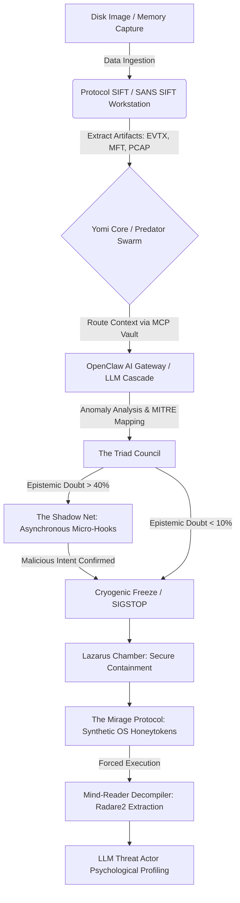
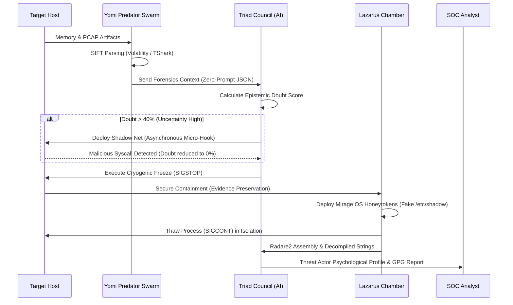

<div align="center">
  <h1>YOMI TRIAGE SYSTEM</h1>
  <p><b>The Ultimate Autonomous Evil Finder & DFIR Copilot</b></p>
  <p><i>Engineered for the SANS "Find Evil!" Hackathon</i></p>
</div>

---

## 1. The Problem & Solution

**The Problem:** Traditional Digital Forensics and Incident Response (DFIR) is agonizingly slow. During an active breach, human analysts spend hours parsing memory dumps, matching signatures, and writing timelines.

**The Solution:** Yomi is a weapon-grade, autonomous DFIR agent powered by Model Context Protocol (MCP) and Local/Cloud LLMs. It integrates directly with the **SANS SIFT Workstation**, executing over 200+ forensic tools automatically. Yomi accelerates triage by 10x---detecting, analyzing, and freezing threats (via `SIGSTOP`) in milliseconds, without human keyboard input or evidence spoliation.

## 2. System Architecture

Yomi bridges the gap between raw forensic data and AI-driven decision-making through a strict, Type-Safe MCP Vault.

### System Architecture


## 3\. DFIR Triage Lifecycle

How Yomi autonomously hunts "Evil" across the kill-chain, from initial ingestion to SOC analyst handover.

### Threat Detection Workflow (Triage Lifecycle)

Code snippet



## 4\. Indicators of Evil (IoE) & MITRE ATT&CK Mapping

*Inspired by MemProcFS, Yomi categorizes its findings into strict Indicators of Evil, cross-referenced with MITRE ATT&CK tactics.*

| **IoE Signature** | **Description & Yomi Action** | **MITRE ID** | **False Positives** |
| --- | --- | --- | --- |
| **`PE_INJECT`** | Locates malware executing from unbacked memory (VAD manipulation). Yomi extracts the payload via Volatility. | `T1055` | LOW |
| **`YR_RANSOMWARE`** | High-entropy memory regions combined with mass file IO operations. Yomi triggers instant Cryogenic Freeze. | `T1486` | LOW |
| **`PROC_BAD_DTB`** | Invalid DirectoryTableBase indicating DKOM (Direct Kernel Object Manipulation). Yomi deploys The Shadow Net. | `T1014` | HIGH |
| **`PEB_MASQ`** | PEB Masquerading attempts to hide process lineage. Yomi uses Plaso to reconstruct true execution timelines. | `T1036.004` | LOW |
| **`UM_APC`** | User-Mode APC hooks commonly used for stealth execution. Yomi routes binary to Radare2 for decompilation. | `T1055.004` | MEDIUM |
| **`TIME_CHANGE`** | System time changed backwards (Timestomping). Yomi flags the artifact for manual SOC review. | `T1070.006` | LOW |

### 4.5 Advanced Tactical Deception (Anti-Evasion)

Modern APTs and ransomware deploy anti-sandbox techniques (e.g., sleeping when analysis tools are detected). Yomi neutralizes this via the **Lazarus & Mirage Protocols**:

* **The Lazarus Chamber:** Frozen malware is securely copied to an isolated directory and forcefully awakened (`SIGCONT`).

* **The Mirage Protocol:** Yomi dynamically generates synthetic, hallucinatory OS artifacts (e.g., fake SAM registry hives, fake SSH keys, dummy high-value targets) inside the chamber. The malware is tricked into believing it has compromised a production server, forcing it to unpack its payload for Yomi's **Mind-Reader Decompiler** to extract its assembly logic via Radare2.

## 5\. Supported Artifacts & SIFT Toolchain

Yomi natively integrates with the following SANS SIFT Workstation tools via its Air-Gapped MCP Vault:

-   **Memory (RAM):** `Volatility 3` (Extracting network connections, hidden processes, injected code).

-   **Timelines:** `Plaso / Log2Timeline` (Super-timeline creation from EVTX, Syslog, Apache).

-   **Disk/File System:** `The Sleuth Kit (TSK)` (Recovering deleted MFT entries).

-   **Binary Analysis:** `Radare2 / YARA` (Reverse engineering and signature matching).

-   **Network Forensics:** `TShark / TCPDump` (Parsing PCAP files to identify Command & Control beaconing and lateral movement).


## 6\. Installation & Getting Started

Yomi is designed to run directly within the SANS SIFT Workstation environment (or Codespaces Mock Mode).

**One-Liner Execution (SIFT Terminal):**

```bash
git clone https://github.com/ArcVielLouvent/yomi-triage-system.git && cd yomi-triage-system && pip install -r requirement.txt && python yomi-triage --auto

```

**Manual Boot:**

```bash
# 1. Start the Background Scraping Daemon (Threat Intel)
python yomi_engine/library.py

# 2. Engage the Sentinel Loop, Swarm, and Zero-Prompt Copilot
python yomi_core/sentinel.py

# 3. Engage the Ouroboros Watchdog & OS Camouflage (Ghost Protocol)
python yomi_core/ghost.py

# 4. Generate Remediation Scripts (The Reverser)
python yomi_engine/remediator.py

# 5. Deploy Asynchronous Micro-Hooks (The Shadow Net)
python yomi_engine/shadow_net.py

# 6. Isolate & Force-Execute dormant malware (Lazarus Chamber)
python yomi_engine/sandbox.py

# 7. Inject OS Honeytokens into Sandbox (The Mirage Protocol)
python yomi_engine/mirage.py

# 8. Radare2 Assembly Extraction & Threat Actor Profiling
python yomi_engine/mind_reader.py

```

## 7\. Demo & Proof of Execution

*(To be populated post-beta testing with live malware samples)*