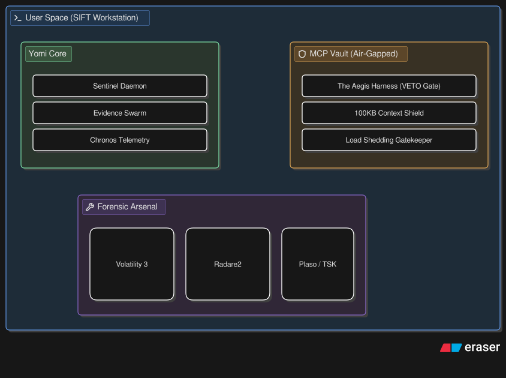
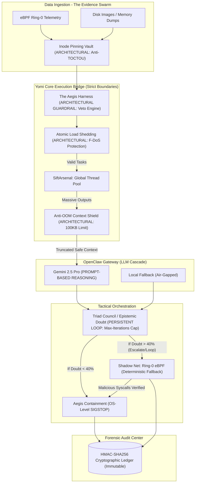
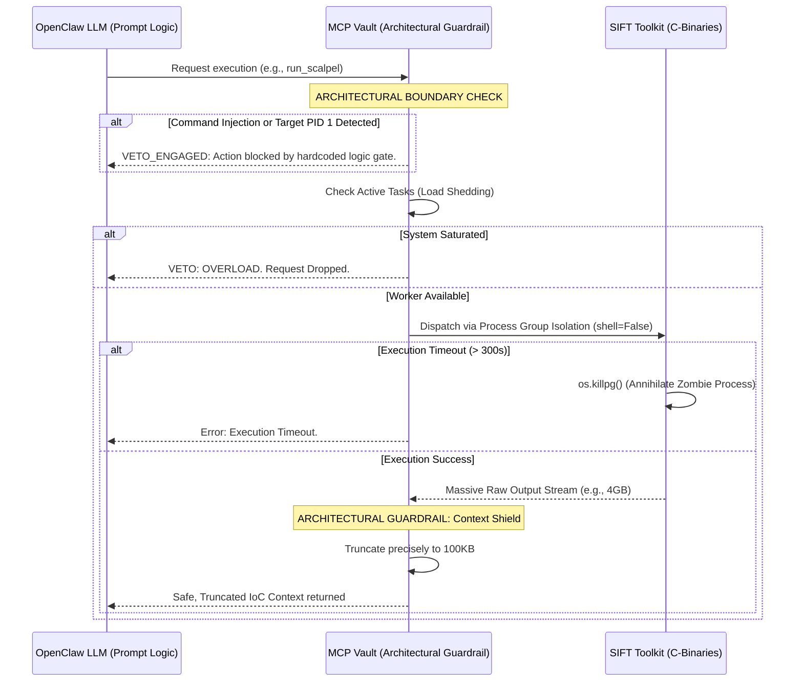
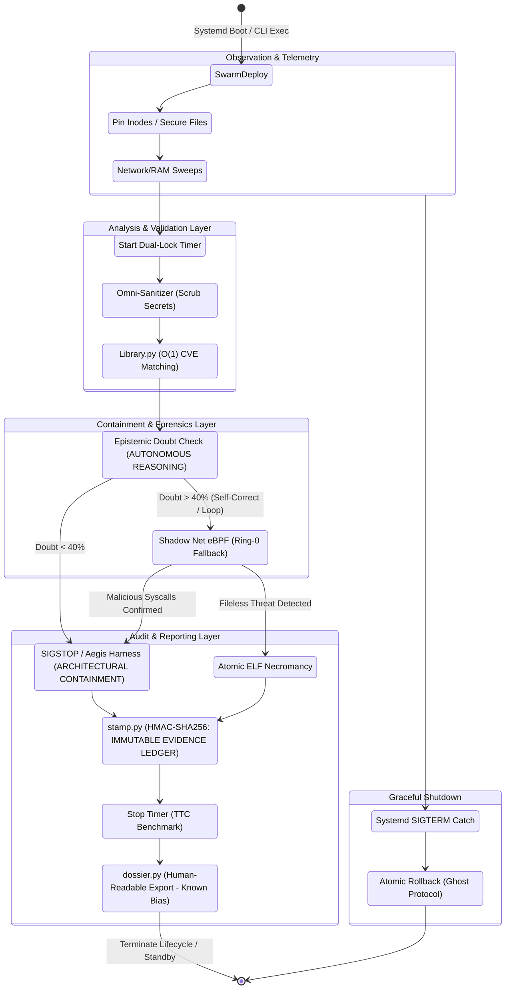

  <h1>YOMI TRIAGE SYSTEM</h1>
  <h2>System Architecture & Module Reference</h2>

## Table of Contents
1. [System Architecture & Data Flow](#1-system-architecture--data-flow)
2. [Yomi Lifecycle & Module Interoperability](#2-yomi-lifecycle--module-interoperability)
3. [Yomi Core Engines (The Arsenal)](#3-yomi-core-engines-the-arsenal)

---

## 1. System Architecture & Data Flow

Yomi intentionally separates the forensic ingestion layer, AI reasoning layer, and audit containment layer to enforce strict security boundaries. The LLM acts purely as a reasoning engine, while the OSBridge and MCP Vault handle physical execution.

### 1.1 Macro System Architecture

The following diagram maps how components connect (Evidence Swarm -> Aegis OSBridge -> OpenClaw Gateway -> Remediator). It shows where the Air-Gapped Harness executes architectural VETO constraints before commands ever reach the OS layer, distinctly separating LLM prompt logic from hardcoded deterministic logic.

### 1.2 MCP Tool Execution & Anti-Spoliation Data Flow

This sequence demonstrates how the MCP Server acts as an architectural guardrail. It prevents LLM hallucinations from executing arbitrary commands and forces the agent to self-correct if it provides invalid arguments, requests missing tools, or if the underlying forensic tool crashes.

### 1.3 Security Boundary Enforcement Summary

-   **Prompt-Based Guardrails:** Prompt engineering is used *only* for cognitive formatting (e.g., instructing the LLM to output valid JSON or map findings to MITRE ATT&CK). Prompts are **never** relied on for system safety.

-   **Architectural Guardrails (Enforced):** Security boundaries are enforced via Python logic gates outside the LLM's context window. The `Aegis Harness` utilizes deterministic `if/else` evaluations against protected PIDs. The `Context Shield` utilizes strict `buffer.read(100000)` OS-level limits. An LLM hallucination physically cannot bypass these mechanisms.

## 2. Yomi Lifecycle & Module Interoperability

The state diagram below shows how Yomi's Python modules interact dynamically during an active incident, from swarm deployment through containment to audit sealing. This modular design prevents deadlocks and ensures rapid threat response.

> **Module wiring (Fase 6, Tahap 1):** `sentinel.py`'s autonomous loop wires in all 13 modules via `yomi_core/guardian.py`'s `GuardianOrchestrator`, gated entirely by `yomi_core/module_registry.py`. `swarm`, `hunter`, `router`, `mitre_mapper`, and `telemetry` run every observation cycle; `mind_reader`, `remediator`, `dossier` dispatch after a synchronous containment success; `shadow_net` dispatches (fire-and-forget) on escalation; `sandbox` and `mirage` dispatch after containment if their invasive tier is explicitly enabled; `ghost` and `ebpf_sensor` are wired at CLI startup. See [`docs/known_issues.md`](known_issues.md) #11 for the full dispatch design and #25/#26 for two env-var gating inconsistencies found and fixed while wiring this.

## 3. Yomi Core Engines (The Arsenal)

Beyond standard MCP wrappers, Yomi implements several deeply integrated, advanced DFIR subsystems:

- **The Evidence Swarm (`swarm.py`):** The central orchestrator. Hardened with **Inode Pinning (OS Hardlinks)** to obliterate Time-of-Check to Time-of-Use (TOCTOU) attacks. Uses an **Anti-OOM Context Shield (100KB Dynamic Truncation)** and bounded regex to prevent Catastrophic Backtracking (ReDoS) when ingesting massive datasets.

- **The Aegis Harness (`harness.py`):** The Zero-Trust Policy Gatekeeper. Before any OS-level intervention (freeze/thaw) is routed to the Kernel, the Harness validates it. Built with **Kernel Thread Immunity** (safeguarding intangible OS structures without `exe_path` limits) and **Realpath Pinning** to defeat Process Name Spoofing and Symlink Path Hijacking.

- **Chronos Telemetry Engine (`telemetry.py`):** Uses a **Dual-Lock Architecture** and **O(1) Memory Eviction** to ensure zero RAM bloat during massive, multi-threaded incident tracking, delivering cryptographically signed latency benchmarks.

- **Human-Readable Executive Dossiers (`dossier.py` & `weaver.py`):** Procedurally generates human-readable forensic timelines mapped to MITRE ATT&CK. The court-ready evidence lives in the JSONL ledger; this module compiles rapid PDF/TXT annexes for human analysts.

- **The Omni-Library (`library.py` v4.0):** An O(1) local Threat Intelligence Database. Uses In-Memory LRU Caching and Memory-Safe Streams to query NVD/CVE definitions without causing Out-of-Memory (OOM) spikes during intense triage.

- **OmniVector Root-Cause Hunter (`hunter.py`):** Traces "Patient Zero" by correlating Volatility memory artifacts with Plaso super-timelines and TSK deleted file recoveries, using strict word-boundary regex.

- **Mind-Reader Decompiler (`mind_reader.py`):** Autonomously executes Radare2 against frozen malware to extract Assembly logic. Built with a **Native Python Extraction Fallback**: if Radare2 fails or is unavailable, it gracefully degrades to a native 1MB binary string extraction so the LLM never loses actionable artifacts.

- **The Lazarus Chamber & Mirage Protocol (`mirage.py` & `sandbox.py`):** A deep isolation sandbox. Extracted malware is awakened (`SIGCONT`) within a synthetic hallucinated environment. Built with an Autonomous Orphan Sweeper to prevent storage bloat.

- **The Shadow Net (`ebpf_sensor.py` & `shadow_net.py`):** Injects C code directly into the Linux Ring-0 Kernel via Tracepoints. Features **Secure ELF Necromancy** to physically reconstruct fileless malware from RAM into an **Atomic Vault** (secured with an explicit `os.chmod(0o700)` right after directory creation -- see [`docs/known_issues.md`](known_issues.md) #23 for why relying on `os.umask()` alone was insufficient).

- **Aegis Reverser Engine (`remediator.py`):** Automatically generates and GPG-signs verifiable bash scripts to roll back changes made by malware. Hardened against Bash Comment Injection (newline stripping) and enforces strict military-grade triage ordering (`SIGSTOP -> DUMP -> SIGKILL`).

- **Ghost Protocol (`ghost.py`):** Deep OS Camouflage. Evades malware anti-analysis by masquerading the Yomi daemon as a standard OS process (e.g., `[kworker/u4:2]`). Armed with an autonomous **Dead Man's Switch (Watchdog)** that seals a final cryptographic log if malware successfully issues a kill signal to the EDR.

- **The OMNISCIENT Torii Gateway (`dashboard.py` v10.0):** A responsive, real-time, non-blocking Terminal UI (TUI) built with `rich`. Hardened against Terminal Spoofing, Lock Starvation, and VFS I/O Lag.

---

See also: [`docs/security.md`](security.md) for the threat model and hardening detail behind these modules, and [`docs/known_issues.md`](known_issues.md) for the running log of confirmed gaps and fixes across all of them.
