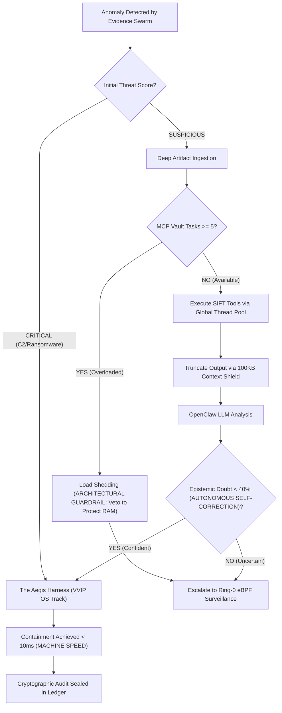

<div align="center">
  <h1>YOMI TRIAGE SYSTEM</h1>
  <h2>Usage & Operational Guide</h2>
</div>

## Table of Contents
1. [Usage & Operational Commands](#1-usage--operational-commands)
2. [Installing as a Persistent Daemon (Linux)](#2-installing-as-a-persistent-daemon-linux)
3. [Verifying and Observing Yomi](#3-verifying-and-observing-yomi)
4. [Use-Case Scenario & Tactical Playbook](#4-use-case-scenario--tactical-playbook)
5. [Performance & Scalability Metrics](#5-performance--scalability-metrics)

---

## 1. Usage & Operational Commands

Yomi uses a centralized CLI entry point (`yomi_core/cli.py`) to manage its various daemons and interfaces. *Note: `sudo` is required to enable Ring-0 eBPF tracepoint interception, event-driven OS telemetry, and secure inode hardlinking.*

**1. Launch Obsidian Torii Gateway (interactive TUI & autonomous mode):**

```bash
sudo python3 yomi_core/cli.py --auto
```

**2. Launch with Ghost Protocol (deep OS camouflage & dead man's switch):**

Evades malware anti-analysis by masquerading the Yomi daemon as a standard OS process (e.g., `[kworker/u4:2]`). If malware attempts to kill Yomi, the armed watchdog intercepts the SIGTERM and seals a final cryptographic tamper-alert log before going down.

```bash
sudo YOMI_MODULE_GHOST=true python3 yomi_core/cli.py --auto
```

*(Fase 6 breaking change: this used to be `YOMI_ENABLE_GHOST_PROTOCOL=true`, a separate env var that bypassed the module registry entirely -- see [`docs/known_issues.md`](known_issues.md) #26. It's now gated the same way as every other optional module.)*

**3. Launch as background daemon (headless):**

```bash
sudo python3 yomi_core/cli.py --auto --headless
```

**4. Install OS-level boot persistence:**

Generates a raw Systemd unit file (Linux) or Registry AutoRun entry (Windows) in the current directory -- you then have to move/register it yourself. This is the low-level building block; **most people on Linux want the one-command installer in [Section 2](#2-installing-as-a-persistent-daemon-linux) instead**, which does this step plus everything else (dependency install, systemd registration, verification) automatically.

```bash
sudo python3 yomi_core/cli.py --install
```

**Demo mode:** By default, invasive-tier modules (Shadow Net, Sandbox, Mirage, Ghost Protocol, raw eBPF Sensor) are disabled for safe unattended/enterprise deployment. To see the full feature surface for a live demo, see [`docs/demo_mode.md`](demo_mode.md).

## 2. Installing as a Persistent Daemon (Linux)

`scripts/install_yomi_linux.sh` is the recommended way to run Yomi continuously, surviving reboots, without babysitting a terminal session. One command does everything Section 1's raw `--install` step leaves as manual follow-up.

### 2.1 What it does, in order

1. Verifies you're running as root, on Linux, with `systemctl` available, and Python 3.10+.
2. Warns and asks for explicit confirmation if `yomi_data/audit_hmac.key` already exists in the checkout (see [2.4](#24-why-a-dedicated-venv-and-why-the-hmac-key-warning) for why this matters).
3. Creates an isolated virtual environment at `.venv/` with `--system-site-packages`, then `pip install`s Yomi into it.
4. Checks for the optional Ring-0 eBPF toolchain (`bcc`) -- informational only, doesn't fail the install if missing, since `EBPF_SENSOR` is disabled by default anyway.
5. Generates the systemd unit (via `yomi-triage --install`, using the venv's `yomi-triage` console command), installs it to `/etc/systemd/system/`, runs `daemon-reload`, and `enable --now`s it.
6. Verifies the service actually reports `active`, then prints the exact evidence-store path, status/log/stop/uninstall commands, and how to enable optional modules.

### 2.2 Running it

```bash
git clone https://github.com/ArcVielLouvent/yomi-triage-system.git
cd yomi-triage-system
sudo ./scripts/install_yomi_linux.sh
```

Idempotent -- safe to re-run after a `git pull` to pick up new code; it reinstalls dependencies and restarts the service.

### 2.3 Managing the daemon afterward

| Task | Command |
| :--- | :--- |
| Check it's running | `systemctl status yomi-triage` |
| Watch logs live | `journalctl -u yomi-triage -f` |
| Stop | `sudo systemctl stop yomi-triage` |
| Restart (e.g. after `git pull` + re-running the installer) | `sudo systemctl restart yomi-triage` |
| Disable (stop + don't start on boot) | `sudo systemctl disable --now yomi-triage` |
| Fully uninstall | `sudo systemctl disable --now yomi-triage && sudo rm /etc/systemd/system/yomi-triage.service && sudo systemctl daemon-reload` |

### 2.4 Why a dedicated venv, and why the HMAC key warning

Two things the installer does that aren't obvious, both found by actually running the installer against a real Ubuntu base rather than assumed safe from reading the code:

- **`pip install .` fails outright on modern Debian/Ubuntu without a venv** (`externally-managed-environment`, PEP 668). The installer sidesteps this with an isolated venv rather than `--break-system-packages`, which would be a bad idea for a persistent daemon anyway (it can silently break other system Python tooling).
- **The venv is created with `--system-site-packages`.** `bcc` (the Ring-0 eBPF toolchain `EBPF_SENSOR` needs) has to be installed via `apt` into the *system* Python -- [Section 1 of `docs/installation.md`](installation.md) is explicit that it should never be `pip install`ed. A fully-isolated venv would make `bcc` permanently unreachable even if you installed it correctly, silently breaking `EBPF_SENSOR` forever. `--system-site-packages` lets the venv see it.
- **`pip install .` packages `yomi_data/` like any other Python module** (it has an `__init__.py`, so `setuptools` includes it same as `yomi_core`/`yomi_engine`). This has two consequences, tracked as [`docs/known_issues.md`](known_issues.md) #27 and #28:
  - The evidence ledger, notary checkpoint, CVE store, and HMAC key for a `pip`-installed daemon end up inside `.venv/lib/python3.*/site-packages/yomi_data/`, **not** in your git checkout. The installer prints the exact resolved path at the end of a successful run -- treat that path as your chain-of-custody evidence store, and back it up accordingly.
  - If a dev/test `yomi_data/audit_hmac.key` already exists in your checkout when you run the installer, it gets copied into the "production" install too -- meaning a non-production key could end up signing your real evidence ledger. The installer detects this and requires you to explicitly type `y` to continue; anything else aborts. If you hit this and don't want to reuse the key, delete `yomi_data/audit_hmac.key` first and re-run.

### 2.5 Enabling optional modules on an installed daemon

Since the daemon runs via systemd, not an interactive shell, module env vars go through a systemd override rather than being set inline on the command line:

```bash
sudo systemctl edit yomi-triage
```

Add under `[Service]`:
```ini
[Service]
Environment=YOMI_MODULE_GHOST=true
Environment=YOMI_MODULE_SHADOW_NET=true
```

Then apply it:
```bash
sudo systemctl daemon-reload && sudo systemctl restart yomi-triage
```

See [`docs/demo_mode.md`](demo_mode.md) for the full list of module keys and what each one does.

## 3. Verifying and Observing Yomi

### 3.1 The chain of custody ledger

Every action Yomi takes -- from a routine scan finding nothing, to an autonomous SIGSTOP, to a Guardian-dispatched rollback script -- is appended as one JSON object per line to the evidence ledger:

- **Source checkout / `--auto` runs:** `yomi_data/yomi_chain_of_custody.jsonl`
- **`pip`-installed daemon:** inside the venv -- see [2.4](#24-why-a-dedicated-venv-and-why-the-hmac-key-warning) above for the exact path, or re-run the installer to have it reprinted.

Tail it live while Yomi is running:

```bash
tail -f yomi_data/yomi_chain_of_custody.jsonl
```

Each line is a JSON object with (at minimum) `record_id`, `timestamp_utc`, `agent`, `action_type`, `description`, `hash`, `previous_hash`, and (when an HMAC key is configured) `entry_hmac` -- see [`docs/security.md`](security.md#1-security--compliance-framework) for the cryptographic chain-of-custody design. A few `action_type` values worth recognizing while reading it:

| `action_type` | Emitted by | Meaning |
| :--- | :--- | :--- |
| `AUTONOMOUS_CONTAINMENT` | Sentinel | Instant SIGSTOP fired on a CRITICAL threat, before any LLM call. |
| `SUCCESS` (agent `HARNESS`) | Harness | An LLM-approved freeze/thaw intent passed veto checks and reached the OS. |
| `VETO_ENGAGED` | Harness | An intent was blocked by architectural (non-LLM) guardrails. |
| `DECOMPILATION_FALLBACK` / `PROFILE_GENERATED` / `KNOWLEDGE_UPDATED` | MindReader | Guardian-dispatched binary analysis, its LLM profiling step, and the resulting CVE-mimicry knowledge-base entry. |
| `ABORTED` (agent `REVERSER`) | Remediator | Guardian dispatched a rollback-script request that failed validation -- check the `description` for why (e.g. a protected system path, per [`docs/known_issues.md`](known_issues.md) #15). |
| `REPORT_SIGNED` (agent `DOSSIER`) | Dossier | Guardian's unconditional end-of-incident report generation completed. |
| `GUARDIAN`-agent entries ending in `_DISPATCH_ERROR` | GuardianOrchestrator | A dispatched module raised an exception -- caught and logged, never crashes the observation loop. See `yomi_core/guardian.py`'s module docstring. |

Verify the ledger hasn't been tampered with at any time:

```python
from yomi_audit.stamp import ImmutableStamp
print(ImmutableStamp().verify_ledger())   # True if the hash chain (and HMAC, if configured) is intact
```

### 3.2 Proving the wired pipeline works end-to-end: the smoke test

`scripts/smoke_test_cli.py` boots a **real** `SentinelDaemon` (with a **real** `GuardianOrchestrator`), feeds it a synthetic CRITICAL anomaly naming a real (harmless) subprocess, and asserts the resulting ledger contains the expected trail -- proving the whole chain is wired correctly on your machine, not just that the test suite passes in an isolated sandbox. It's the standalone equivalent of `tests/integration/test_chain_sentinel_router_harness.py::test_critical_threat_chain_freezes_real_process_end_to_end`, runnable without `pytest`.

```bash
python3 scripts/smoke_test_cli.py
# or, as part of the full suite:
./run_tests.sh smoke
```

It's self-contained and non-destructive: it isolates every data path to a temp directory (see the script's own docstring for exactly which paths and why), spawns and kills its own harmless test subprocess, and never touches your real `yomi_data/`. Only one boundary is mocked -- the LLM API call itself -- everything else (harness veto logic, `os_bridge.cryogenic_freeze`, Guardian's dispatch decisions) runs for real.

A passing run looks like this (captured output, not a hypothetical example):

```
[smoke_test_cli] Constructing SentinelDaemon (boots GuardianOrchestrator)...
[smoke_test_cli] Spawning a real, harmless test subprocess...
[smoke_test_cli] Feeding synthetic CRITICAL anomaly for PID 493...
[SENTINEL] [BLOOD RED] CRITICAL THREAT DETECTED. Executing immediate SIGSTOP on PID 493...
...
[smoke_test_cli] [PASS] Process was actually SIGSTOP'd (verified via /proc).
[smoke_test_cli] [PASS] Sentinel's instant SIGSTOP was sealed to the ledger.
[smoke_test_cli] [PASS] GuardianOrchestrator dispatched DOSSIER (unconditional, end-of-incident).
[smoke_test_cli] [PASS] GuardianOrchestrator dispatched REMEDIATOR against the real interpreter path, and #14/#15's containment fix correctly refused it (protected system directory).

[smoke_test_cli] All assertions passed. Sentinel -> Guardian -> Harness chain is wired correctly.
```

Exit code `0` means every assertion held; `1` means something is wired wrong on that machine (missing dependency, permission issue, a module misconfigured) -- the specific failure is printed. Run it after any fresh install, after `git pull`ing new code, or any time you want independent confirmation Yomi actually works here, not just that it's supposed to.

### 3.3 Triggering and observing a real containment scenario manually

If you want to watch Yomi react to an anomaly step-by-step yourself (rather than the automated assertions above), the safest reproducible way is the same one the smoke test and integration tests use: a real, harmless subprocess, fed in as a synthetic anomaly. **Do not use a real malware sample for this** -- Yomi's containment is real (a genuine `SIGSTOP`/`SIGKILL`), and the point here is to observe the response safely.

1. In one terminal, start Yomi (any of the modes from [Section 1](#1-usage--operational-commands)) and leave the ledger tailing in a second terminal:
   ```bash
   tail -f yomi_data/yomi_chain_of_custody.jsonl
   ```
2. In a third terminal, start a harmless long-running process to act as your "target":
   ```bash
   sleep 300 &
   echo "Target PID: $!"
   ```
3. Yomi's autonomous loop reacts to anomalies it detects itself through `SwarmOrchestrator`/`OmniVectorHunter` (network, memory, filesystem signals) -- a bare `sleep` won't trigger anything by itself, since it isn't anomalous. To see the full containment-and-dispatch chain deterministically without waiting on organic detection or staging real malicious behavior, use the smoke test in [3.2](#32-proving-the-wired-pipeline-works-end-to-end-the-smoke-test) instead -- it performs exactly this kind of synthetic-anomaly injection against a real subprocess, safely and reproducibly.
4. To exercise real detection paths instead of synthetic injection, see [`docs/demo_mode.md`](demo_mode.md), which walks through enabling the invasive-tier modules and staging realistic (but controlled) artifacts SIFT's own sample datasets provide.

## 4. Use-Case Scenario & Tactical Playbook

### Scenario: The 5-Second Containment

This flowchart shows how Yomi reasons about next steps, handles system failures (via F-DoS load-shedding vetoes), and executes sub-second OS-level containment without waiting for human intervention.



The MITRE ATT&CK mapping table referenced by this flow now lives in [`docs/security.md`](security.md#supported-mitre-attck-mapping).

## 5. Performance & Scalability Metrics

Yomi executes forensic workflows magnitudes faster than human analysts. Below is raw, validated telemetry from `telemetry_benchmarks.jsonl` demonstrating consistent ~3.002-second latency from detection to containment logic.

```json
{
    "incident_id": "INCIDENT_PID_0_1780238736",
    "action": "ESCALATED_TO_SHADOW_NET",
    "latency_seconds": 3.0025,
    "human_speed_multiplier": "399.7x Faster",
    "beat_horizon3_ai": true
}
```

Benchmark regression tracking (`scripts/check_benchmark_regression.py`) compares each run only against its own environment's prior baseline -- absolute latency numbers are machine-dependent, so cross-machine comparisons are intentionally not made. See [`docs/known_issues.md`](known_issues.md) for details on how this is enforced.
