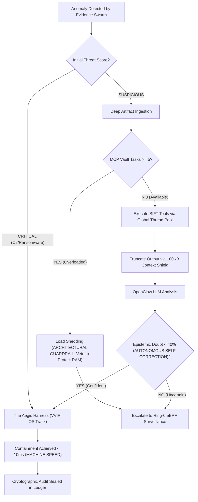

<div align="center">
  <h1>YOMI TRIAGE SYSTEM</h1>
  <h2>Usage & Operational Guide</h2>
</div>

## Table of Contents
1. [Usage & Operational Commands](#1-usage--operational-commands)
2. [Use-Case Scenario & Tactical Playbook](#2-use-case-scenario--tactical-playbook)
3. [Performance & Scalability Metrics](#3-performance--scalability-metrics)

---

## 1. Usage & Operational Commands

Yomi uses a centralized CLI entry point (`yomi_core/cli.py`) to manage its various daemons and interfaces. *Note: `sudo` is required to enable Ring-0 eBPF tracepoint interception, event-driven OS telemetry, and secure inode hardlinking.*

**1. Launch Obsidian Torii Gateway (interactive TUI & autonomous mode):**

```bash
sudo python3 yomi_core/cli.py --auto
```

**2. Launch with Ghost Protocol (deep OS camouflage & dead man's switch):**

Evades malware anti-analysis by masquerading the Yomi daemon as a standard OS process (e.g., `[kworker/u4:2]`). If malware attempts to kill Yomi, the armed watchdog intercepts the SIGTERM and seals a final cryptographic tamper-alert log before going down.

```bash
sudo YOMI_MODULE_GHOST=true python3 yomi_core/cli.py --auto
```

*(Fase 6 breaking change: this used to be `YOMI_ENABLE_GHOST_PROTOCOL=true`, a separate env var that bypassed the module registry entirely -- see [`docs/known_issues.md`](known_issues.md) #26. It's now gated the same way as every other optional module.)*

**3. Launch as background daemon (headless):**

```bash
sudo python3 yomi_core/cli.py --auto --headless
```

**4. Install OS-level boot persistence:**

Installs Yomi as a Systemd service (Linux) or Registry AutoRun (Windows).

```bash
sudo python3 yomi_core/cli.py --install
```

**Demo mode:** By default, invasive-tier modules (Shadow Net, Sandbox, Mirage, Ghost Protocol, raw eBPF Sensor) are disabled for safe unattended/enterprise deployment. To see the full feature surface for a live demo, see [`docs/demo_mode.md`](demo_mode.md).

## 2. Use-Case Scenario & Tactical Playbook

### Scenario: The 5-Second Containment

This flowchart shows how Yomi reasons about next steps, handles system failures (via F-DoS load-shedding vetoes), and executes sub-second OS-level containment without waiting for human intervention.



The MITRE ATT&CK mapping table referenced by this flow now lives in [`docs/security.md`](security.md#supported-mitre-attck-mapping).

## 3. Performance & Scalability Metrics

Yomi executes forensic workflows magnitudes faster than human analysts. Below is raw, validated telemetry from `telemetry_benchmarks.jsonl` demonstrating consistent ~3.002-second latency from detection to containment logic.

```json
{
    "incident_id": "INCIDENT_PID_0_1780238736",
    "action": "ESCALATED_TO_SHADOW_NET",
    "latency_seconds": 3.0025,
    "human_speed_multiplier": "399.7x Faster",
    "beat_horizon3_ai": true
}
```

Benchmark regression tracking (`scripts/check_benchmark_regression.py`) compares each run only against its own environment's prior baseline -- absolute latency numbers are machine-dependent, so cross-machine comparisons are intentionally not made. See [`docs/known_issues.md`](known_issues.md) for details on how this is enforced.
